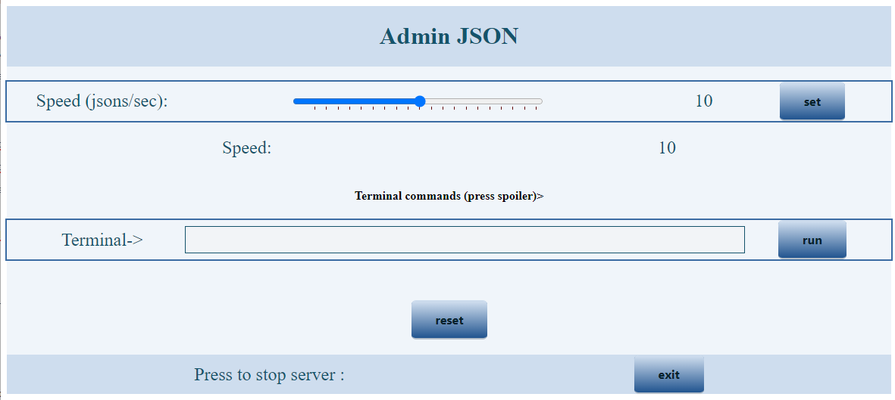
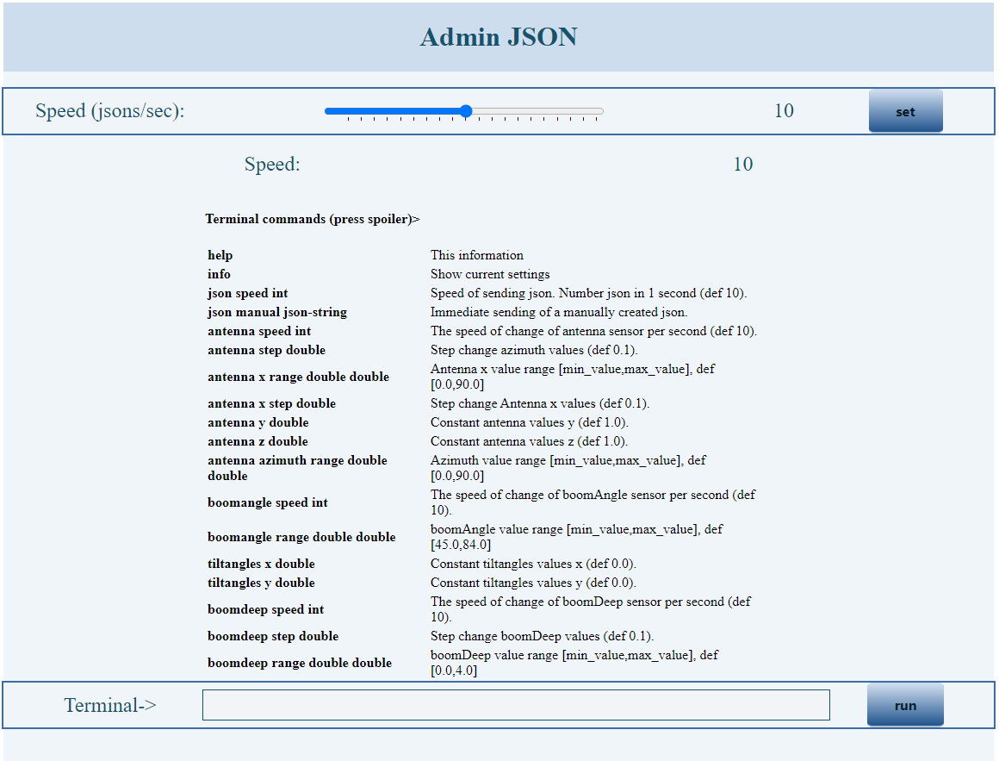
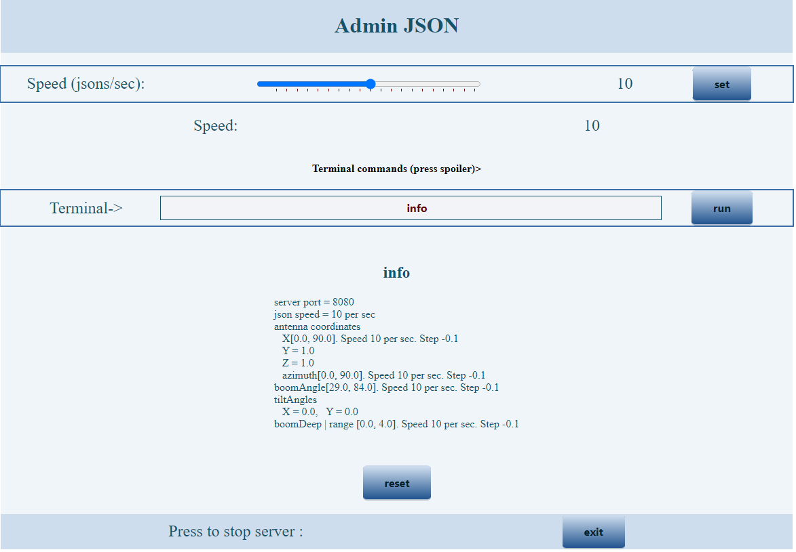

# -Excavator-Sensors-Demo
<h2>Симулятор работы датчиков экскаватора. Связь backend с frontend Unity</h2>

java -jar wsdemoweb.jar       - запустится 8080 по умолчанию
В командной строке можно указать любой свободный порт, например "java -jar wsdemoserver.jar 8090"

Передача данных от backend к frontend происходит через JSON. 
Считываем данные с датчиков БК значение сразу отправляем на fronend. 
Основные данные которые передаем от backend к frontend: 
Координаты Антенны навигации и азимут направления техники XYZ Azimut (antennaCoordinates) 
Например  
<ul>
  <li>- 100,54;150,54;180,1;5,0</li>
</ul>
Угол наклона мачты с ковшем (boomAngle), расстояние от крепления мачты до ковша (boomDeep), данные с инклинометров (tiltAngles). 
Например:  
<ul>
  <li>датчик стрелы 14,5 градусов,</li>
  <li>датчик углов наклона 2,4 по X и 1,3 по Y градусов</li>
</ul>
Стрела выдвинута на 2,45 метра. 

Данные по умолчанию идут на WebSocket, порт 8080.
Скорость - 10 JSON в секунду.
Скорость изменения всех значений тоже 10 в секунду.
Через команды терминала все параметры можно изменить.

Пример: {"antennaCoordinates":{"x":18.5,"y":1.0,"z":1.0,"azimuth":17.5},"boomAngle":62.5,"tiltAngles":{"x":0.0,"y":0.0},"boomDeep":1.5}
При опускании стрелы до минимума, посылается JSON {"bucketDump":1}, сигнализирующий об открытии ковша.

Значения по умолчанию:
- antennaCoordinates x                    меняется от 0.0 до 90.0 с шагом 0.1 синхронно с передачей 10 значений в сек. 
                     y=1.0, z=1.0         константы, 
                     azimuth              меняется от 0.0 до 90.0 с шагом 0.1 синхронно с передачей 10 значений в сек.
- boomAngle                               меняется от 45.0 до 84.0 с шагом 0.1 синхронно с передачей 10 значений в сек.
- tiltAngles         x=0.0, y=0.0         константы.
- boomDeep                                меняется от 0.0 до 4.0 с шагом 0.1 синхронно с передачей 10 значений в сек.

Когда какое-либо значение достигнет своего максимума, начнется уменьшение этого значения до минимума с тем же шагом. И так по циклу.

При каждом новом подключении, выбрасываются два JSON:
<ul>
  <li> {"HPInit":"EQsize",'EQid':12,'Name':'ЭКГ 12',"BC":9.0,"BG":8.2,"L":13.0} - параметры и размеры обрабатывемого блока(в демо они неизменяемые).</li>
  <li>{"HPLoc":"1","id":1,"height":0.0,"material":"Ore from DB","color":"Color from DB","label":"Ore to the factory","coords":[{"numPoint":1,"x":21758.0,"y":81563.0,"z":-45.0},{"numPoint":2,"x":21760.0,"y":81519.0,"z":-45.0},{"numPoint":3,"x":21744.0,"y":81514.0,"z":-45.0},{"numPoint":4,"x":21723.0,"y":81509.0,"z":-45.0},{"numPoint":5,"x":21703.0,"y":81506.0,"z":-45.0},{"numPoint":6,"x":21631.0,"y":81482.0,"z":-45.0},{"numPoint":7,"x":21622.0,"y":81473.0,"z":-45.0},{"numPoint":8,"x":21613.0,"y":81472.0,"z":-45.0},{"numPoint":9,"x":21597.0,"y":81474.0,"z":-45.0},{"numPoint":10,"x":21588.0,"y":81479.0,"z":-45.0},{"numPoint":11,"x":21581.0,"y":81481.0,"z":-45.0},{"numPoint":12,"x":21572.0,"y":81494.0,"z":-45.0},{"numPoint":13,"x":21587.0,"y":81537.0,"z":-45.0},{"numPoint":14,"x":21600.0,"y":81544.0,"z":-45.0},{"numPoint":15,"x":21607.0,"y":81546.0,"z":-45.0},{"numPoint":16,"x":21619.0,"y":81547.0,"z":-45.0},{"numPoint":17,"x":21679.0,"y":81552.0,"z":-45.0},{"numPoint":18,"x":21708.0,"y":81559.0,"z":-45.0},{"numPoint":19,"x":21758.0,"y":81563.0,"z":-45.0}]} данные о полигоне обработки</li>
</ul>

Второй JSON с данными полигона отрабатываемого блока. В этом демо-сервере их 13 штук. Меняются по очереди при каждом подключении. Когда доходим до последнего, перескакиваем на первый и так по кругу.

Для отключения сервера можно набрать команду exit или послать GET запрос на "ip:port/exit".

<h3>Команды терминала</h3>
<ul>
  <li>help - выводит таблицу со списком команд и краткой аннотацией к ним.</li>
  <li>info - выводит на экран текущие настройки генерации json (скорость, шаг, пределы и т.д.)</li>
  <li>json speed <int> - установить новую скорость генерации JSON. Целое число от 0 до 100 штук в секунду. По умолчанию - 10.  Например : "json speed 5" установит 5 штук в секунду.
Если команда была набрана без ошибок, появится подтверждение: New speed: 5 files per second. Если что-то не так, ничего не изменится и сообщений не будет.</li>
  <li>json manual <json string> - отправить произвольный JSON. Формат json не проверяется. Отправляется как есть. Пример: json manual {"text":"Many many symbols"}</li>
  <li>antenna speed <int> - установить новую скорость обновления значений координат антенны. От 1 до 100. По умолчанию - 10. Ноль не ставится. Если нужно остановить обновление координат, лучше поставьте шаг обновления равным нулю (следующая в списке команда). Если обновление произошло, будет сообщение-подтверждение. Все изменения можно в любой момент проверить командой info. Т.к. x,y,z- константы, то скорость обновления каждой координаты не регулируется, она общая для всех координат антенны.</li>
  <li>antenna step <double> - установить шаг обновления значений азимута. По умолчанию 0.1.  Если поставить 0, то изменения значений остановятся. Потом можно снова их запустить, поставив любой шаг, но не более верхнего значения азимута (по умолчанию 90.0).</li>
  <li>antenna x range <double> <double> - установить диапазон значений X. [min_value,max_value], по умолчанию [0.0,90.0]. Диапазоны не ставятся меньше 0. Если введете отрицательное число, будет взят модуль. Если минимум окажется больше максимума, они поменяются местами.</li>
  <li>antenna x step <double> - изменить шаг изменения координаты X (по умолчанию 0.1).</li>
  <li>antenna y <double> - изменить константное значение координаты Y. </li>
  <li>antenna z <double> - изменить константное значение координаты Z. </li>
  <li>antenna azimuth range <double> <double> - установить диапазон значений азимута. [min_value,max_value], по умолчанию [0.0,90.0]. Диапазоны не ставятся меньше 0. Если введете отрицательное число, будет взят модуль. Если минимум окажется больше максимума, они поменяются местами.</li>
  <li>boomangle speed <int> - установить новую скорость обновления значений boomAngle (по умолчанию 10 в сек).</li>
  <li>boomangle step <double> - шаг boomAngle (по умолчанию 0.1).</li>
  <li>boomangle range <double> <double> - установить диапазон значений boomAngle [min_value,max_value], по умолчанию [29.0,84.0]</li>
  <li>tiltangles x <double> - изменить константное значение координаты tiltangles.x (def 0.0).</li>
  <li>tiltangles y <double> - изменить константное значение координаты tiltangles.y (def 0.0).</li>
  <li>boomdeep speed <int> -  установить новую скорость обновления значений boomDeep (по умолчанию 10 в сек).</li>
  <li>boomdeep step <double>  - шаг boomDeep (def 0.1).</li>
  <li>boomdeep range <double> <double> - установить диапазон значений boomDeep [min_value,max_value], def [0.0,4.0]</li>
  <li>boomangleopen <double> - установить значение boomAngle при котором будет выбрасываться {"bucketDump":1}, сигнализирующий об открытии ковша. По умолчанию при boomAngle = 29.0.</li>
  <li>reset - сброс всех значений к начальным.</li>
  <li>exit - выключение сервера.</li>
</ul>
---------------------------------------------------------------------------------------------------------

Все значения double кроме констант при вводе округляются до одного знака после запятой.
  
<h3>WEB доступ</h3>
По адресу url:port/admin открывается доступ к web-терминалу. 
 
Terminal commands (press spoiler)> кликабельный. Открывает окно help. 
 
Все команды можно набирать в web-терминале и в консольном терминале одновременно. Работают и те и другие.
Сообщения отражаются ниже терминала, если команда поступила из него и в консоли, если команда пришла из консоли.
 

